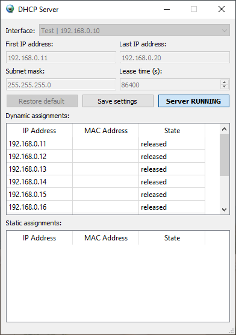

## Introduction

QtDhcpServer is a basic implmentation based on [Qt](https://www.qt.io/) framework, its base idea origins from https://github.com/justinmcbride/qt_dhcp_server.

The main purpose is for running in isolated testing environments and it is **NOT** intended to run in productive environment!
Also, it might not (fully) comply with [RFC 2131](https://tools.ietf.org/html/rfc2131).

## Notes
Settings are saved using the `QSettings` class, thus their behaviour is platform dependent (see [QSettings](https://doc.qt.io/qt-5.15/qsettings.html) reference).
The recently used network interface is saved on program exit, other settings like IP range are saved on button click.

Static assignments are currently read from settings only, a saving mechanism is implemented but not available to the GUI yet.

The software has been developed & tested in Windows 10 environment, thus adaptions to other GUI platforms might be necessary.
Software has been designed in a way to make operation on command line possible, however an CLI needs to be implemented upon your needs.
