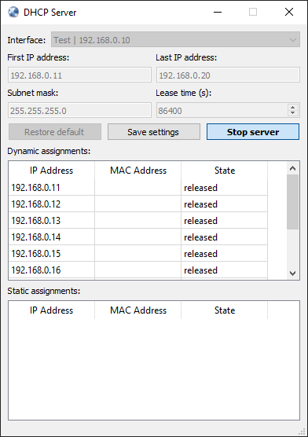

## Introduction

QtDhcpServer is a basic implmentation of a DHCP server based on the [Qt](https://www.qt.io/) framework and origins from the idea of https://github.com/justinmcbride/qt_dhcp_server.

Its primary use case is for running in isolated testing environments and it is **NOT** intended to be used in productive environment! Also, it may not (fully) comply with [RFC 2131](https://tools.ietf.org/html/rfc2131) but feel free to modify / extend the software to your needs.

Altough developed and tested on a Windows 10 environment, it's cross-platform compatible as it is using Qt framework. Please refer to the [Qt website](https://www.qt.io/) for more details on this. Also, the GUI may be tuned to the needs of another platform. Finally, the software is designed in a way that the GUI could be removed at all. In this case, some CLI might be implemented if required.

## Notes
Settings like last selected interface, IP range, etc. are saved using the `QSettings` class, thus their behaviour is platform dependent (see [QSettings](https://doc.qt.io/qt-5.15/qsettings.html) reference).
The recently selected network interface is saved before program exit. Other settings have to be saved manually using the corresponding button.

Static assignments are a way to assign a fixed IP address to a specific client and are also loaded through the same mechanism. A saving routine is implemented, however not available to the GUI ;-)

If a MAC address of a static assignment ends with "00:00:00", it is treated as a wildcard. Thus, all devices of the specified vendor will get the assigned IP address. This might be useful for certain testing purposes.